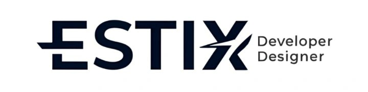

  
  <h1>Hey there! I'm Estiven 👋</h1>
  
<em>Developer & Designer | Tech Enthusiast | Problem Solver</em>

  

---

### 👨🏻‍💻 About Me

💡 Self-taught passionate about technology, automation, and solving real-world problems.

🚀 I enjoy tackling technical challenges, learning new things every day, and building practical solutions.

🧠 I mainly work with databases, backend, APIs, and automations (SQL, Supabase, Apps Script, etc).

🌱 Currently diving deep into systems architecture, applied AI, and process optimization.

✍️ In my free time, I explore new tools, test ideas, and develop personal projects.

💬 Always open to collaborating, exchanging ideas, or helping with tech projects.

---

### 🛠 Tech Stack

**Languages:**  

**Databases & Backend:**  

**Frontend & Tools:**  

---

### 📊 GitHub Analytics

  
  

---

### 🤝 Connect With Me

  
  

---

  
<em>Last updated: 10/02/2026</em>

  
Made with ❤️ by <strong>Estiven Alejandro Carvajal Muñoz</strong>

