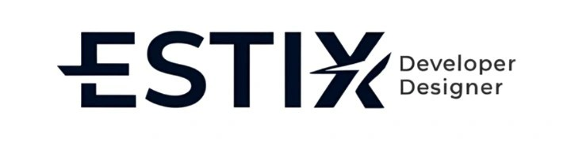

<!-- ============================================== -->
<!-- HEADER                                         -->
<!-- ============================================== -->

<div align="center">


<a href="https://estix-dev-portfolio.netlify.app/">
  
</a>

<br/><br/>

<a href="https://git.io/typing-svg">
  
</a>

<br/><br/>


&nbsp;


<br/><br/>

<a href="https://estix-dev-portfolio.netlify.app/"></a>&nbsp;
<a href="https://www.linkedin.com/in/estiven-alejandro-carvajal-mu%C3%B1oz-1059474511e/"></a>&nbsp;
<a href="mailto:estivencarvajalm@gmail.com"></a>&nbsp;
<a href="https://github.com/EstiXD"></a>&nbsp;
<a href="https://wa.me/3028462917"></a>

</div>

<br/>

<!-- ============================================== -->
<!-- ABOUT ME                                       -->
<!-- ============================================== -->


<h2>
  &nbsp;
  About Me
</h2>

<table>
<tr>
<td width="55%">

```javascript
const estix = {
    name      : "Estiven Alejandro Carvajal Muñoz",
    alias     : "Estix",
    location  : "Colombia 🇨🇴",
    role      : "Full Stack Developer & Automation Designer",
    education : "Técnico en Programación de Software — SENA",
    passion   : "Tech since age 9 with my first computer",
    stack     : ["JavaScript", "TypeScript", "Python", "SQL"],
    tools     : ["Next.js", "React", "Node.js", "Astro", "n8n"],
    motto     : "Code it. Automate it. Ship it."
};
```

</td>
<td width="45%">

I build modern web applications with solid foundations in **databases**, **RESTful APIs**, and automation tools like **n8n** and **Google Apps Script**.

Specialized in **full stack web development** and **process automation**, applying agile methodologies like **Scrum** and **Vibe Coding** to deliver efficient, real-world solutions.

**Always learning. Always building.**

</td>
</tr>
</table>

<br/>

<!-- ============================================== -->
<!-- TECH STACK                                     -->
<!-- ============================================== -->


<h2>
  &nbsp;
  Tech Stack
</h2>

<div align="center">
<table>
<tr>
<td align="center" valign="top" width="25%">

**Languages**

<br/>

<br/>
<br/>


</td>
<td align="center" valign="top" width="25%">

**Frameworks**

<br/>

<br/>
<br/>


</td>
<td align="center" valign="top" width="25%">

**Databases &amp; Deploy**

<br/>

<br/>
<br/>


</td>
<td align="center" valign="top" width="25%">

**Tools &amp; Automation**

<br/>

<br/>
<br/>


</td>
</tr>
</table>
</div>

<details>
<summary align="center"><b>&nbsp;&nbsp;View Skill Levels&nbsp;&nbsp;</b></summary>
<br/>

| Technology | Level | | Technology | Level |
|:---|:---|:---|:---|:---|
| HTML5 |  **90%** | | Tailwind CSS |  **80%** |
| JavaScript |  **85%** | | Next.js |  **75%** |
| CSS3 |  **85%** | | React |  **65%** |
| Python |  **80%** | | GitHub |  **85%** |
| TypeScript |  **75%** | | Vercel |  **80%** |
| SQL |  **80%** | | RESTful APIs |  **80%** |
| Node.js |  **80%** | | n8n |  **70%** |

</details>

<br/>

<!-- ============================================== -->
<!-- FEATURED PROJECTS                              -->
<!-- ============================================== -->


<h2>
  &nbsp;
  Featured Projects
</h2>

<div align="center">
<table>
<tr>
<td align="center" width="50%">
<h3><a href="https://bookflix-nine.vercel.app/">BookFliX</a></h3>

<br/><br/>
Free digital library with a <b>Netflix-style</b> interface to discover, upload, and read books and PDFs online.
<br/><br/>


</td>
<td align="center" width="50%">
<h3><a href="https://dashboard-ia-skydropx.vercel.app/login">Dashboard QA - Skydropx</a></h3>

<br/><br/>
Quality control dashboard with <b>ticket analysis</b>, real-time metrics and KPIs for tracking.
<br/><br/>


</td>
</tr>
<tr>
<td align="center" width="50%">
<h3><a href="https://huevos-semicriollos.vercel.app/">Huevos Semicriollos</a></h3>

<br/><br/>
E-commerce for selling <b>fresh and natural eggs</b> in Bogota with daily home delivery.
<br/><br/>


</td>
<td align="center" width="50%">
<h3><a href="https://estix-weeb-hook.vercel.app/">Estix Webhook</a></h3>

<br/><br/>
Control panel for <b>webhook management</b> with user authentication and operations admin.
<br/><br/>


</td>
</tr>
<tr>
<td align="center" width="50%">
<h3><a href="https://wl-logistics.vercel.app/">WL Logistics</a></h3>

<br/><br/>
Modern logistics <b>dashboard</b> for metrics, tracking, and monitoring with control panel.
<br/><br/>


</td>
<td align="center" width="50%">
<h3>Coming Soon</h3>

<br/><br/>
<b>Estix Pedidos</b> - Order management<br/>
<b>Sistema POS</b> - Point of sale<br/>
<b>Productive Web</b> - Productivity app
<br/><br/>


</td>
</tr>
</table>
</div>

<br/>

<!-- ============================================== -->
<!-- GITHUB ANALYTICS                               -->
<!-- ============================================== -->


<h2>
  &nbsp;
  GitHub Analytics
</h2>

<div align="center">

<!-- Trophies -->


<br/><br/>

<!-- Stats + Languages -->

&nbsp;&nbsp;


<br/><br/>

<!-- Streak -->


<br/><br/>

<!-- Activity Graph -->


</div>

<br/>

<!-- ============================================== -->
<!-- EDUCATION & CERTIFICATIONS                     -->
<!-- ============================================== -->


<h2>
  &nbsp;
  Education &amp; Certifications
</h2>

<div align="center">
<table>
<tr>
<td align="center" width="50%">
<br/>

<br/><br/>
<b>Tecnico en Programacion de Software</b><br/>
<sub>Servicio Nacional de Aprendizaje</sub><br/>
<code>2023 - 2024</code> · Certified
<br/><br/>
</td>
<td align="center" width="50%">
<br/>

<br/><br/>
<b>Colegio Villas del Progreso</b><br/>
<sub>High School Diploma</sub><br/>
<code>2023 - 2024</code> · Graduated
<br/><br/>
</td>
</tr>
</table>
</div>

<details>
<summary align="center"><b>&nbsp;&nbsp;View All 11 Certifications&nbsp;&nbsp;</b></summary>
<br/>
<div align="center">
<table>
<tr>
<td align="center" width="33%">
<br/>
<b>Desarrollo Web</b><br/>
<sub>Universidad Nacional de Colombia</sub>
</td>
<td align="center" width="33%">
<br/>
<b>Desarrollo Web con PHP</b><br/>
<sub>SENA</sub>
</td>
<td align="center" width="33%">
<br/>
<b>Variables y Estructuras - Python</b><br/>
<sub>SENA</sub>
</td>
</tr>
<tr>
<td align="center">
<br/>
<b>Analisis Exploratorio - Python</b><br/>
<sub>SENA</sub>
</td>
<td align="center">
<br/>
<b>POO con Java</b><br/>
<sub>SENA</sub>
</td>
<td align="center">
<br/>
<b>Bases de Datos con MySQL</b><br/>
<sub>SENA</sub>
</td>
</tr>
<tr>
<td align="center">
<br/>
<b>Redes y Seguridad</b><br/>
<sub>SENA</sub>
</td>
<td align="center">
<br/>
<b>Configuracion IPv6</b><br/>
<sub>SENA</sub>
</td>
<td align="center">
<br/>
<b>Adobe Photoshop</b><br/>
<sub>SENA</sub>
</td>
</tr>
<tr>
<td align="center">
<br/>
<b>English Does Work - Level 2</b><br/>
<sub>SENA</sub>
</td>
<td align="center">
<br/>
<b>Working in a Digital World</b><br/>
<sub>IBM SkillsBuild</sub>
</td>
<td align="center">
<br/>
<b>Always Learning</b><br/>
<sub>Never Stop Growing</sub>
</td>
</tr>
</table>
</div>
</details>

<br/>

<!-- ============================================== -->
<!-- WORKFLOW                                        -->
<!-- ============================================== -->


<h2>
  &nbsp;
  How I Work
</h2>

<div align="center">

&nbsp;
&nbsp;
&nbsp;
&nbsp;
&nbsp;
&nbsp;
&nbsp;
&nbsp;
&nbsp;
&nbsp;


<br/><br/>

&nbsp;
&nbsp;
&nbsp;


</div>

<br/>

<!-- ============================================== -->
<!-- CONNECT + FOOTER                               -->
<!-- ============================================== -->


<div align="center">

<h2>
  &nbsp;
  Let's Connect!
</h2>

<p><b>Open to collaborations, freelance work, and exciting projects.</b></p>
<p>Let's build something amazing together!</p>

<br/>

<a href="mailto:estivencarvajalm@gmail.com"></a>&nbsp;
<a href="https://wa.me/3028462917"></a>&nbsp;
<a href="https://www.linkedin.com/in/estiven-alejandro-carvajal-mu%C3%B1oz-1059474511e/"></a>&nbsp;
<a href="https://estix-dev-portfolio.netlify.app/"></a>

<br/><br/>

<!-- Snake -->
<picture>
  <source media="(prefers-color-scheme: dark)" srcset="https://raw.githubusercontent.com/platane/snk/output/github-contribution-grid-snake-dark.svg" />
  <source media="(prefers-color-scheme: light)" srcset="https://raw.githubusercontent.com/platane/snk/output/github-contribution-grid-snake.svg" />
  
</picture>

<br/><br/>


<br/><br/>

<sub>Made with lots of coffee and passion by <b>Estiven Carvajal</b></sub>

<br/><br/>


</div>
